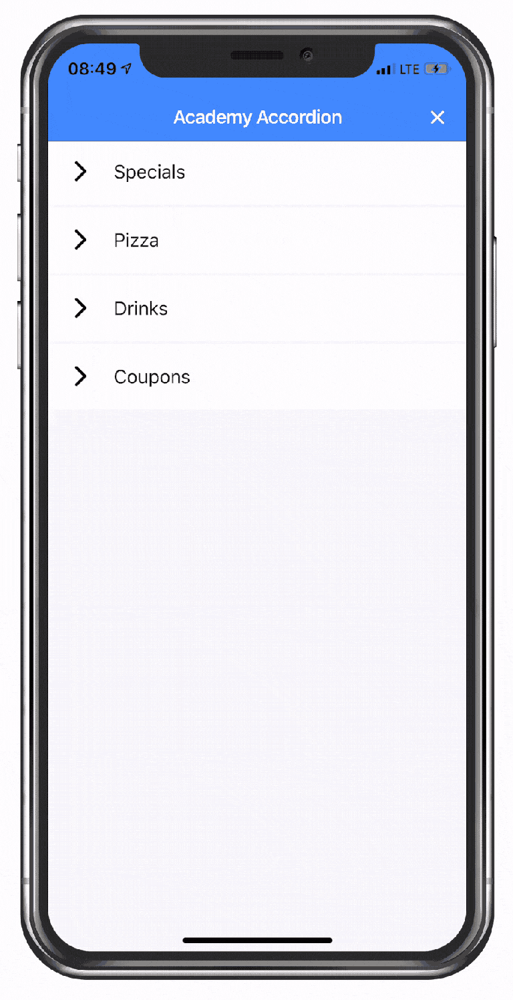

# Building an Accordion List with Ionic [v4]

While the Ionic list with all it’s options and sliding elements is a great component, sometimes you need a more advanced behaviour like a classic accordion.

Origin: https://youtu.be/w5PR_d6eiQI
